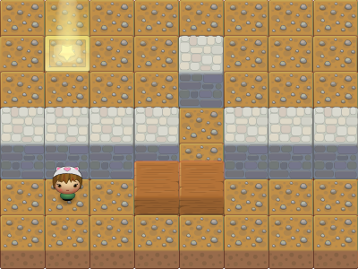
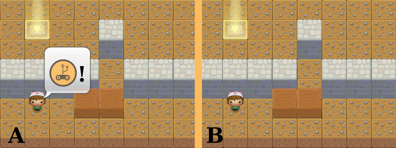
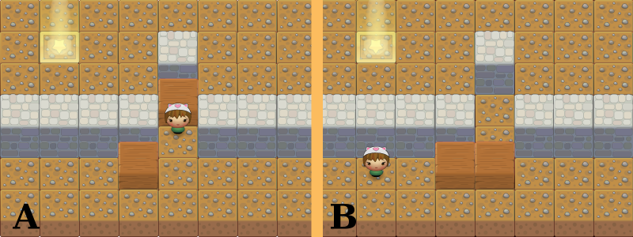
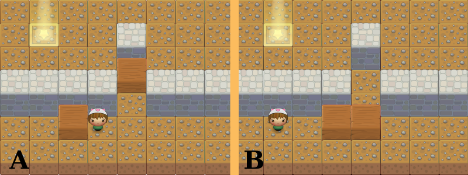
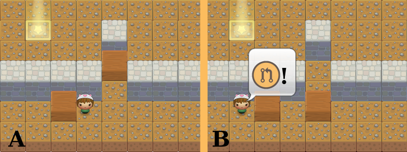
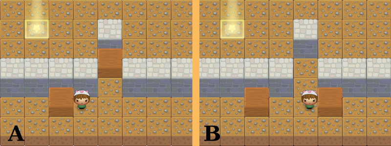
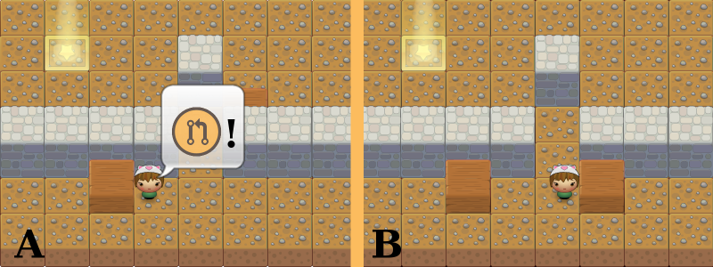
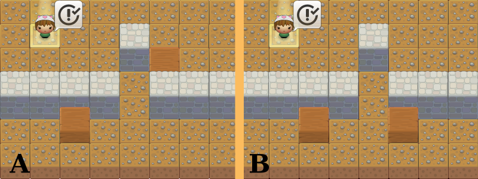

# Octocarina of time

This is just brainstorming at this point, but here is my idea. This drawing of Octocat dressed as Link, at the bottom of the [challenge page](https://github.com/blog/1303-github-game-off), was the source of my inspiration.

## Origin

I immediately thought of a Zelda clone, featuring Octocat as Link. To fit the theme, I decided that Octocat should carry a fork instead of a sword. I thought that "Octocarina of Time" would be a nice parody name.

I then went to the whiteboard and wrote down ideas for the game. In the original [Ocarina of Time](http://en.wikipedia.org/wiki/The_Legend_of_Zelda:_Ocarina_of_Time), the timeline splits into two (the "young Link" and "old Link" timelines) when Link picks up the Master Sword. I thought that this was another great opportunity to cater to the theme: Octocat shall *fork* the timeline by picking up the Master Fork.

I tried to imagine how the two forked timeline should interact, and I knew at once that I didn't want to make yet another [Chronotron](http://www.kongregate.com/games/Scarybug/chronotron) / [The Company of Myself](http://www.kongregate.com/games/2DArray/the-company-of-myself) / [P.B. Winterbottom](http://www.winterbottomgame.com/) clone. The different timelines should interact with each other, but the character should not interact with past clones of itself (even though "clones" is one of the themes). Trying to see if other GitHub concepts could be applied, I tried to come up with a way in which actions or objects in one timeline could be pushed or pulled between timelines. I came up with the following puzzle mechanics.

## Game mechanic: Pushing changes between timelines

1.   
   Octocat enters this room, and wants to reach the star tile. But how?  
   
1.   
   First, Octocat splits the timeline.  
   
1.   
   In timeline A, Octocat moves block 1. This blocks his passage, but allows block 2 to be moved.  
   In timeline B, the blocks are still in their original locations.  
   
1.   
   Now that block 1 is out of the way, Octocat A moves block 2.  
   
1.   
   This is the important step: Octocat B pulls block 2's movement from timeline A.  
   Block 2 moves, even though block 1 is still in its original location! Without the ability to push changes between timelines, this configuration would be impossible, because block 1 was in way, preventing Octocat B from pushing block 2.  
   
1.   
   With block 2 out of the way, block 1 can be moved in a different direction.  
   Octocat B moves block 1. When moved in that direction, the block does not block the passage.  
   Octocat B can reach the star tile! But what about Octocat A?
   
1.   
   Octocat A pulls block 1's movement from timeline B.  
   In timeline A, block 1 starts from a different position, but the movement applies cleanly because there is no obstacle on its right. Without the ability to push changes between timelines, this move would again be impossible, because Octocat A couldn't have pushed block 1 from his side of the passage.  
   
1.   
   The two Octocats proceed to the goal tile, and move on to the next level.

That's it! That mechanic summarises the entire gameplay. Like [Escape from Puppy Death Factory](http://armorgames.com/play/12210/escape-from-puppy-death-factory)'s swap gun, this is probably a power which is very powerful, but which you must learn to adopt one step at a time, learning new tricks gradually as you encounter harder and harder obstacles.

## Details

A few more details about the mechanic:

* Changes to individual objects can be pushed individually; you don't need to push the entire timeline's changes.
* Changes to the same object, however, are linked together. When you push an object's changes to another timeline, you push all of the object's changes since the last change from that object which that timeline saw.
* If a change cannot be applied (because in that timeline, there is a wall in the way or something), then there is a conflict, and no more changes can be pushed from that object to that timeline.
* All forked Octocats must reach the goal tile.

I'm not sure how to deal with nested forks yet, maybe they shouldn't be allowed.

## Special Thanks

I am using PlanetCute, a [free tileset](http://www.lostgarden.com/2007/05/dancs-miraculously-flexible-game.html) generously offered by Daniel Cook for the express purpose of *not* making yet another Sokoban clone. Sorry, Danc! Anyway, [his blog](http://www.lostgarden.com/) is a great source of insight for independent games developers.
